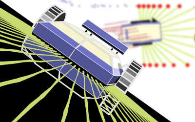

# LOST ROBOT

> If I'd written the mapping module, it wouldn't be offline!

Well, Jörg didn't write the module
and as a result we now have a robot that doesn't know the way back anymore
because the mapping module is offline.
Fortunately, the remote interface is working as expected.



## System Requirements

- Chrome, Edge or Firefox with ES6 support

- Keyboard (there are no touch controls)

## Build App

```
# The app uses as gutted Kontra.js version.
git clone --single-branch --branch custom-js13k-build https://github.com/Rayne/kontra.git vendor/kontra

# NPM packages are only needed for building the ZIP file.
npm install

# Builds the ZIP file.
./bin/build
```

## Build Maps

- [SVG MAP Format and Workflow](docs/MAP_FORMAT_SVG.md)

- [JSON MAP Format](docs/MAP_FORMAT_JSON.md)

## Libraries

- [Kontra](https://github.com/straker/kontra)

- [SAT](https://github.com/jriecken/sat-js)

- [ZzFX](https://github.com/KilledByAPixel/ZzFX)
